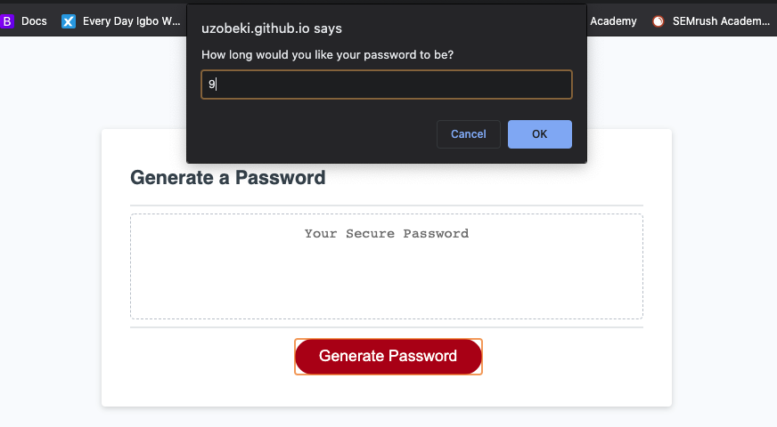
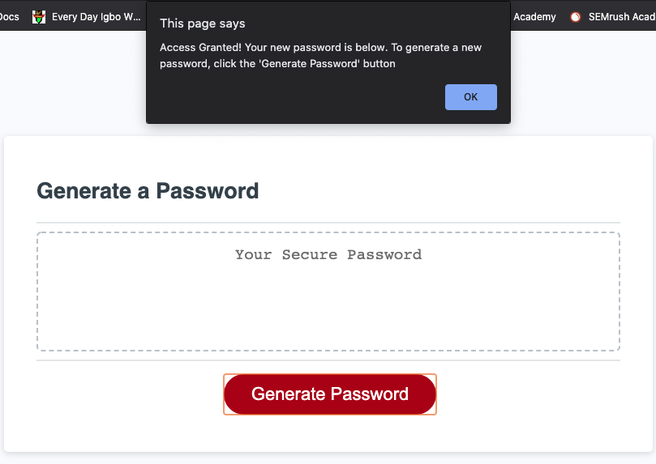
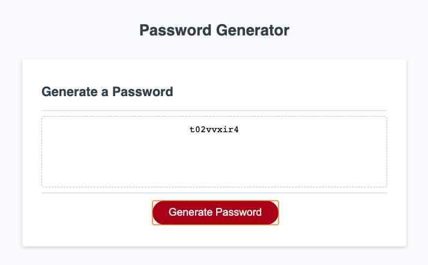

# Access-Granted
## Task :man_technologist:
We were tasked with fixing the Password Generator application. The goal of the generator is to take in input from the user such as the length of the password and
the characters they would like to use in the password. 

## Thoughts and Notes :thinking:
This felt like one of the hardest things I have ever worked on, but the end result was so rewarding. Assignments such as this one puts in to perspective just how much Javascript is truly utilized 
within every site we use.

## Technologies Used
Languages: HTML, CSS, Javascript

## Links
https://uzobeki.github.io/Access-Granted/
## Authors
Uzochukwu Obeki